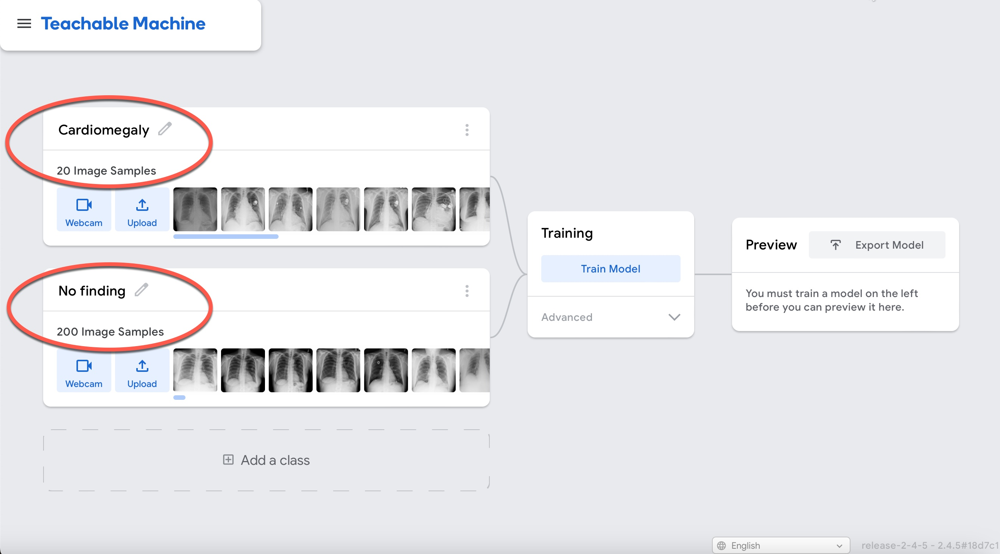
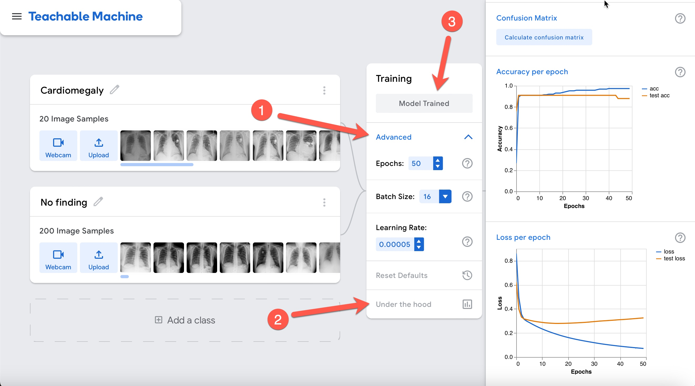
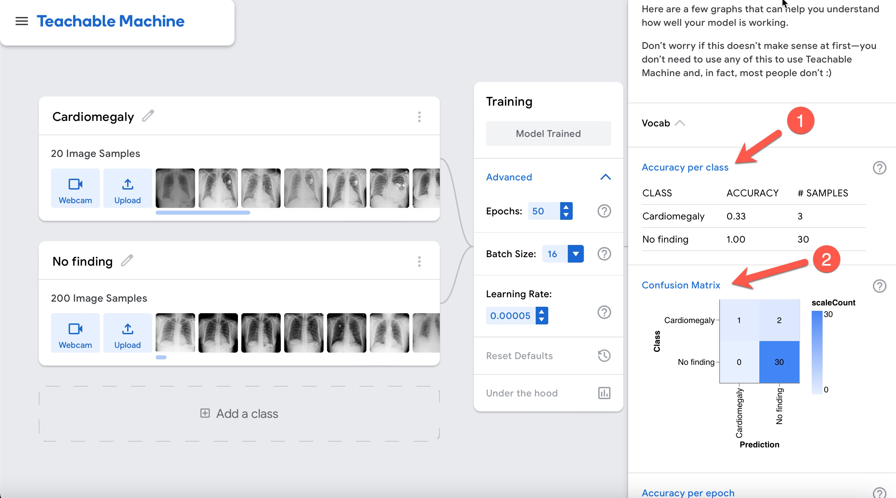
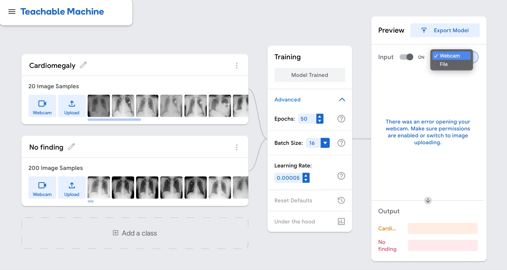
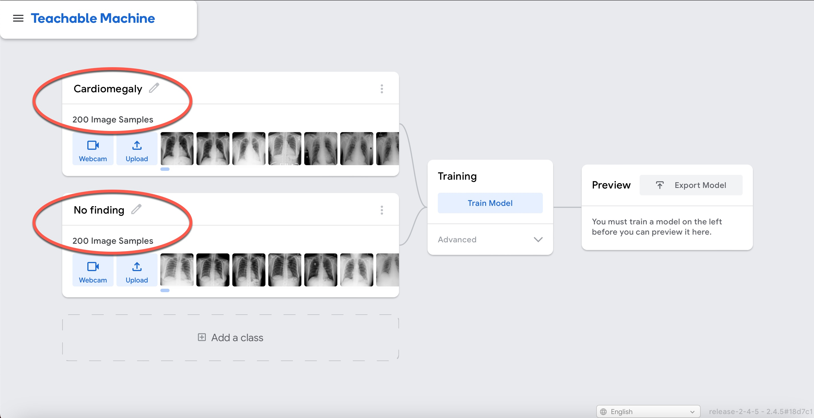
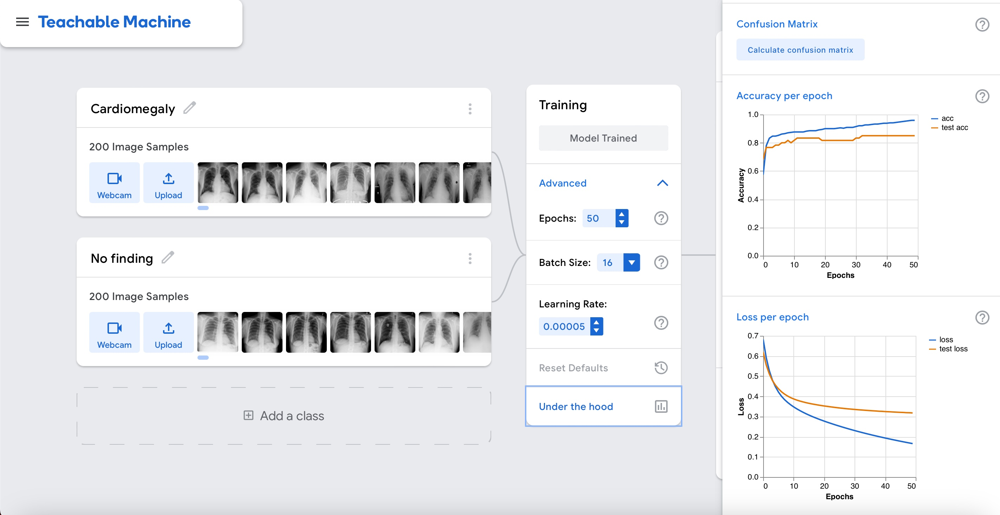
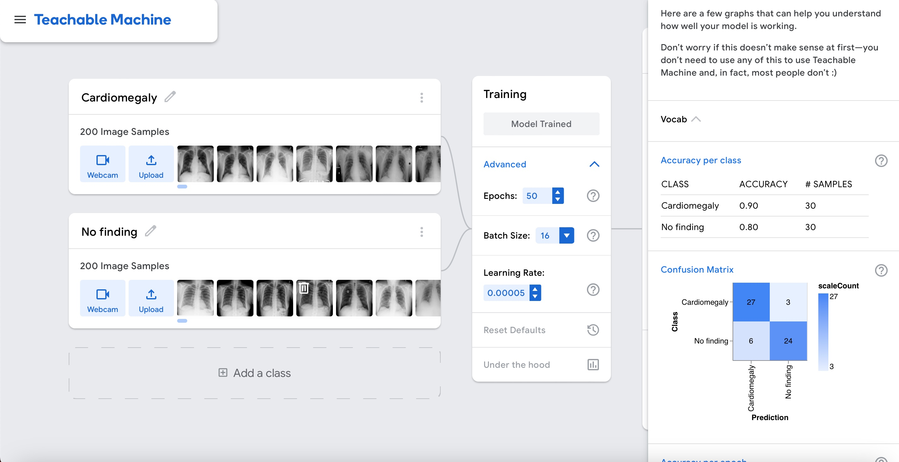
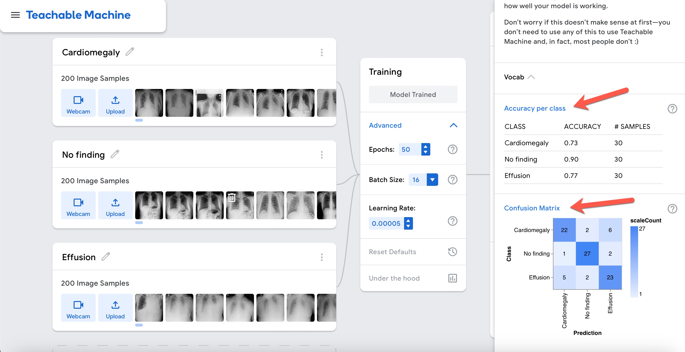
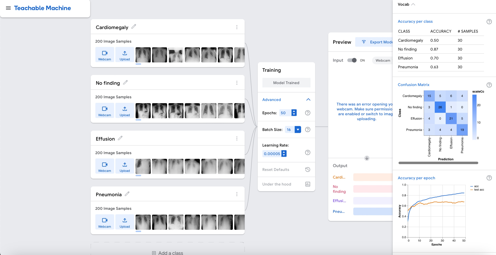
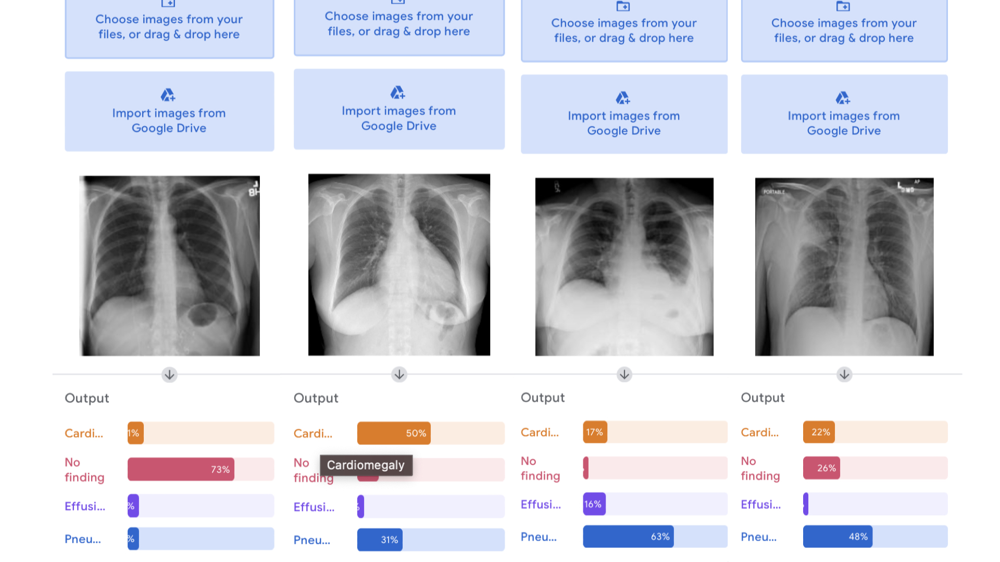

# RSNA Spotlight 2023

## AI Implementation: Building Expertise and Influence.

## Acknowledgements

The medical images for this session (chest x-rays) were obtained from: Wang X, Peng Y, Lu L, Lu Z, Bagheri M, Summers RM. ChestX-ray8: Hospital-scale Chest X-ray Database and Benchmarks on Weakly-Supervised Classification and Localization of Common Thorax Diseases. IEEE CVPR 2017 and are available [here](https://www.nih.gov/news-events/news-releases/nih-clinical-center-provides-one-largest-publicly-available-chest-x-ray-datasets-scientific-community).

## Basics of Image Classification
In the field of radiology, one of the most common tasks is the interpretation of chest X-rays. This task, at its core, is image classification.

### How Convolutional Neural Networks (CNNs) work
To aid in this classification task with the use of computers, we will introduce a Convolutional Neural Network (CNN), a type of neural network that is especially good at recognizing patterns and objects in images, much like a team of specialized radiology trainees.

### Layers of the CNN
#### Convolutional Layers:
Imagine that each of these specialized radiology trainees focuses in identifying certain features in the X-ray. One might be proficient at noticing abnormalities in the cardiomediastinal contour, another at discerning variations in lung textures, and another at spotting abnormalities in the bone. Their observations are like looking at the X-ray through 'special lenses' or in the case of a CNN: filters.

#### Pooling Layers:
Now, imagine that each of the previous trainees are providing information to a second more senior trainee who takes the detailed observations and summarizes them. If the first trainee notes several areas of abnormal lung texture with opacification of the inferolateral portion of one lung, the second trainee could summarize this as "lung opacity" and "blunting of the costophrenic angle". The process of summarization of the observations is done by the pooling layers in the CNN.

#### Fully Connected Layers:
Finally, a senior trainee considers these summarized notes and forms a preliminary diagnosis, such as "pneumonia" and "pleural effusion". This process of mapping findings or observations to a pre-defined set of labels or diseases is done by the fully connected layer in the CNN.

### Training the Network (Backpropagation and Gradient Descent)
The trainees are shown a vast number of chest X-rays already diagnosed by expert radiologists - this 'labeled data' forms their training material.

In the same way that an expert radiologist points out the errors of a trainee, when a CNN makes an incorrect preliminary diagnosis, there are mechanisms (i.e., backpropagation and gradient descent) that help the network adjust its approach to maximize correct responses. This process is performed iteratively and since there are so many different starting points and potential solutions, each training run might identify different optimal paths. This randomness results in diverse solutions that the CNN can use to diagnose X-rays accurately. However, once a solution is identified (the final weights of the network), as long as we keep the network configuration the same, we can expect the same high level of performance each time we use it.

## Experiments

For this session we will use Teachable Machine, a web-based tool created by Google that allows users to easily create machine learning models without needing any specialized knowledge, programming or advanced hardware.

You will also need access to several files. All these files have been compacted in a single file [here](https://github.com/lprevedello/RSNA-Spotlight-2023/raw/main/experiments/all_downloads.zip) for convenience. If you have trouble downloading or decompressed this file, you will have the opportunity to download each of these files individually later.

To load Teachable machine right click on the link [here](https://teachablemachine.withgoogle.com/train/image) and choose "Open in a new tab" (or hold CTRL key + left mouse click). Please keep the two tabs open.

You should see this website:

### Experiment 1

Download the file for experiment 1 [here](https://github.com/lprevedello/RSNA-Spotlight-2023/raw/main/experiments/experiment1.tm).
Save this file somewhere you can locate later, it will be needed in the next step.

Click on the left upper corner and "Open project from file" to load your first experiment.

Upload the experiment1.tm file and wait for it to load. You should see the following page (please ensure the headings match):

Next, click on (1) Advanced to expand additional options, (2) Under the Hood to show real-time model training performance and (3) Train Model to start training your model.

Accuracy is very high as shown in the graph above. However, is the model really performing well? Let's interpret the results by clicking on the "Accuracy per class" and "Confusion matrix" buttons.

Notice how poor the performance actually is! This discrepancy relates to the unbalanced nature of the data. Notice that there are 10 times more normals than cases of cardiomegaly. If the model guesses everything normal it would be 80% accurate despite being of no help at all. Be careful with accuracy in unbalanced data scenarios!

We can actually prove how poor the performance of the model is by testing it with the following example:

To download a cardiomegaly case righ + click [here](https://github.com/lprevedello/RSNA-Spotlight-2023/blob/main/images/cardiomegaly.jpg) and chose "Download Linked File".

Exit out of the "Under the hood" widget by clicking on the X sign in the upper right corner. Click on the option "Webcam" and change to "File" in the Preview widget.

Upload the cardiomegaly case and notice how the model's inference is incorrect: "No finding" in a clear case of cardiomegaly.

Let's see how things change if we make the dataset balanced.

### Experiment 2

Download the file for experiment 2 [here](https://github.com/lprevedello/RSNA-Spotlight-2023/raw/main/experiments/experiment2.tm).
Save this file somewhere you can locate later, it will be needed in the next step.

Click on the left upper corner and "Open project from file" to load your first experiment.

Upload the experiment2.tm file and wait for it to load. You should see the following page (please ensure the headings match):

Next, click on (1) Advanced to expand additional options, (2) Under the Hood to show real-time model training performance and (3) Train Model to start training your model.

Accuracy is relatively high as shown in the graph above. But this time around it seems real. Let's interpret the results by clicking on the "Accuracy per class" and "Confusion matrix" buttons.

This time the model can differentiate cardiomegaly cases from cases without cardiomegaly.

We can actually see if this is the case by testing it with the same example as before:

Use the cardiomegaly case you previously downloaded or download it again by right clicking [here](https://github.com/lprevedello/RSNA-Spotlight-2023/blob/main/images/cardiomegaly.jpg) and chosing "Download Linked File"..

Exit out of the "Under the hood" widget by clicking on the X sign in the upper right corner. Click on the option "Webcam" and change to "File" in the Preview widget.

Upload the cardiomegaly case and observe the output of the model. It should be better than before.

Now, let's make things a bit more interesting and add another finding: pleural effusion.

### Experiment 3

Download the file for experiment 3 [here](https://github.com/lprevedello/RSNA-Spotlight-2023/raw/main/experiments/experiment3.tm).
Save this file somewhere you can locate later, it will be needed in the next step.

Click on the left upper corner and "Open project from file" to load your first experiment.

Upload the experiment3.tm file and wait for it to load. You should see the following page (please ensure the headings match):

Next, click on (1) Advanced to expand additional options, (2) Under the Hood to show real-time model training performance and (3) Train Model to start training your model.

Accuracy is relatively high as shown in the graph above. Let's interpret the results by clicking on the "Accuracy per class" and "Confusion matrix" buttons.

The model can differentiate reasonably well among cardiomegaly, effusion, and cases without any of these abnormalities. However, based on the confusion matrix, the model mixes cases of effusion and cardiomegaly. This starts to make sense when you look at the cases in the cardiomegaly dataset and see that there are several cardiomegaly cases with pleural effusion in the same image.

This brings up an important point. For the purpose of this experiement, we have simplified things and the findings are being considered mutually exclusive. This type of experiment is called multi-class classification. In this type of classification problem a case can be in one and only one of three or more classes. In reality, the correct method to determine the findings in chest-ray would be multi-label classification in which each case can have more than one class.

Despite this limitation, let's see if the model is able to distinguish among these classes by running inference on three different examples: (right click and download as a linked file each) [cardiomegaly](https://github.com/lprevedello/RSNA-Spotlight-2023/blob/main/images/cardiomegaly.jpg), [effusion](https://github.com/lprevedello/RSNA-Spotlight-2023/blob/main/images/effusion.jpg), and [normal](https://github.com/lprevedello/RSNA-Spotlight-2023/blob/main/images/normal.jpg).

Upload the three cases and observe the output of the model. It should look something like this:

Now let's make things even more interesting and add yet another finding: pneumonia.

### Experiment 4

If you perform the same steps described previously for the file experiment4.tm [available here](https://github.com/lprevedello/RSNA-Spotlight-2023/raw/main/experiments/experiment4.tm), you should see something similar to this:

Now that you have a model, let's run inference on four different cases: (right click and download as a linked file each if you still don't have them) [cardiomegaly](https://github.com/lprevedello/RSNA-Spotlight-2023/blob/main/images/cardiomegaly.jpg), [effusion](https://github.com/lprevedello/RSNA-Spotlight-2023/blob/main/images/effusion.jpg), [normal](https://github.com/lprevedello/RSNA-Spotlight-2023/blob/main/images/normal.jpg), and [pneumonia](https://github.com/lprevedello/RSNA-Spotlight-2023/blob/main/images/pneumonia.jpg).

Upload the four cases and observe the output of the model. It should something like this:

Unfortunately, the model was not able to distinguish well between pneumonia and effusion with the examples provided.

However, the goal of this exercise was not to create a clinically ready algorithm, but rather to show some of the most important components of algorithm development so you can:
  * Understand how the overall process to train a deep learning model works
  * Learn basic concepts on how to assess model generalizability and performance
